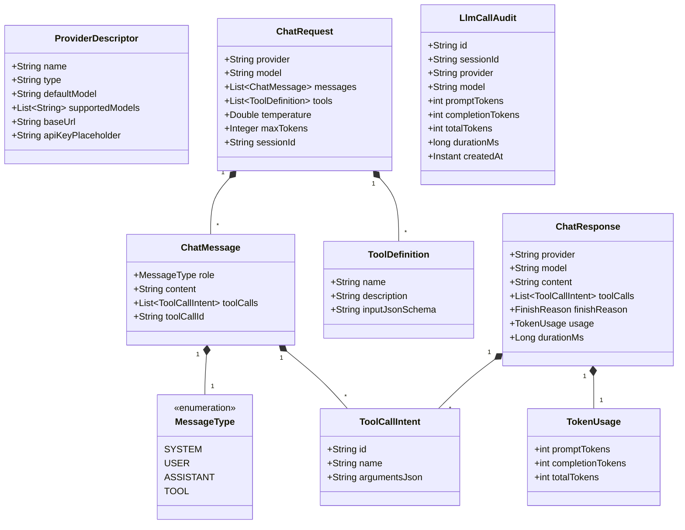

# Phase 1 Data Model: US-1 LLM Provider 对接与显式路由

**Feature**: `001-llm-provider-integration`
**Date**: 2026-08-29

---

## 1. 核心值对象与请求/响应模型

---

## 2. 实体定义与字段规范

### 2.1 `ProviderDescriptor`
描述一个在系统注册的 LLM 提供商实例。
- `name` (String, PK/Unique): Provider 标识符，如 `deepseek`、`qwen`、`kimi`、`openai`、`ollama`、`mock`。
- `type` (String): `CLOUD`、`LOCAL` 或 `MOCK`。
- `defaultModel` (String, Required): 默认模型型号，如 `deepseek-chat`。
- `supportedModels` (List<String>): 支持的模型型号列表。
- `baseUrl` (String, Optional): 自定义 API 地址（用于 OpenAI 代理、本地 Ollama/vLLM 等）。
- `apiKey` (String, Optional): 解析后的真实 API 密钥（通过环境变量注入）。

### 2.2 `ChatRequest`
上层向 `ProviderService` 发起的统一同步对话请求。
- `provider` (String, Required): 目标 Provider 名称。
- `model` (String, Optional): 目标模型型号，若为 null/空则回退到 Provider 的 `defaultModel`。
- `messages` (List<ChatMessage>, Required, non-empty): 多轮对话消息列表。
- `tools` (List<ToolDefinition>, Optional): 注入给模型的可用工具契约列表。
- `temperature` (Double, Optional, 0.0 ~ 2.0): 采样温度。
- `maxTokens` (Integer, Optional): 最大生成 Token 数。
- `sessionId` (String, Optional): 会话上下文 ID（用于审计链路关联）。

### 2.3 `ChatResponse`
`ProviderService` 返回的统一模型生成结果。
- `provider` (String): 实际处理的 Provider 名称。
- `model` (String): 实际调用的模型型号。
- `content` (String): 模型生成的文本内容（若仅触发工具调用可能为空）。
- `toolCalls` (List<ToolCallIntent>): 模型请求调用的工具指令列表。
- `finishReason` (FinishReason): 结束原因（`STOP`、`TOOL_CALLS`、`LENGTH`、`UNKNOWN`）。
- `usage` (TokenUsage): Token 消耗统计（`promptTokens`, `completionTokens`, `totalTokens`）。
- `durationMs` (long): 请求耗时（毫秒）。

### 2.4 `LlmCallAudit` (持久化实体)
对应 SQLite `llm_calls` 审计表。
- `id` (String, UUID): 审计记录唯一 ID。
- `sessionId` (String, Nullable): 会话 ID。
- `provider` (String): Provider 名称。
- `model` (String): 模型型号。
- `promptTokens` (int): 输入 Token 数。
- `completionTokens` (int): 输出 Token 数。
- `totalTokens` (int): 总消耗 Token 数。
- `durationMs` (long): 耗时（毫秒）。
- `createdAt` (Instant): 调用完成时间戳。
