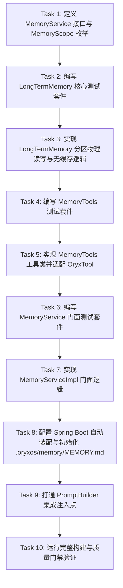

# Tasks: 第22节 Memory 实现与代码讲解

**Branch**: `022-lesson22-memory` | **Plan**: [plan.md](file:///e:/study/aiprogram/oryxos/specs/022-lesson22-memory/plan.md) | **Spec**: [spec.md](file:///e:/study/aiprogram/oryxos/specs/022-lesson22-memory/spec.md)

## 任务依赖关系图

---

## 阶段一：契约定义与核心地基 (Phase 1: Foundations & Contracts)

- [x] **Task 1: 定义 MemoryService 接口与 MemoryScope 枚举**
  - **路径**: `oryxos-core/src/main/java/com/oryxos/memory/`
  - **内容**:
    - 创建 `MemoryScope` 枚举（`CORE`, `ARCHIVAL`）
    - 建立 `MemoryService` 门面接口，包含 `buildContext(Session session)`, `remember(String content, MemoryScope scope)`, `recall(String keyword)`
  - **产物**: `MemoryScope.java`, `MemoryService.java`
  - **依赖**: 无

---

## 阶段二：长期记忆存储与无缓存测试先行 (Phase 2: LongTermMemory TDD)

- [x] **Task 2: 编写 LongTermMemoryTest 验收测试套件 (Harness 先行)**
  - **路径**: `oryxos-memory/src/test/java/com/oryxos/memory/LongTermMemoryTest.java`
  - **内容**:
    - 测试用例 1: `截断只裁归档区_核心记忆一字不能少`（归档区灌超 4000 字符，断言核心记忆完整无缺、归档区头部截断）
    - 测试用例 2: `写入后立刻可读_不允许有缓存`（append 写入后同一进程下一次 load 与 recall 立即命中）
    - 测试用例 3: `scope路由到正确区块_缺省写入归档区`（分别写入 core 和 archival，验证落在对应标题下）
    - 测试用例 4: `recallByKeyword只搜归档区_不区分大小写`（仅搜归档区，大小写不敏感包含匹配）
  - **产物**: `LongTermMemoryTest.java`
  - **依赖**: Task 1

- [x] **Task 3: 实现 LongTermMemory 物理存储类**
  - **路径**: `oryxos-memory/src/main/java/com/oryxos/memory/LongTermMemory.java`
  - **内容**:
    - 实现 `append(String content, MemoryScope scope)`：按 `## 核心记忆` / `## 归档记忆` 定位追加 `\n- [YYYY-MM-DD] 内容`
    - 实现 `load()`：零缓存直接读取物理文件，完整返回核心区，通过 `truncateIfNeeded` 截断归档区
    - 实现 `recallByKeyword(String keyword)`：仅针对归档区逐行做大小写无关包含匹配
    - 实现 `truncateIfNeeded(String archiveSection)`：保留最新 4000 字符（`MAX_ARCHIVE_CHARS = 4000`）
    - 文件不存在时自动初始化两分区骨架
  - **产物**: `LongTermMemory.java`
  - **依赖**: Task 2

---

## 阶段三：Agent 记忆工具开发与契约适配 (Phase 3: MemoryTools)

- [x] **Task 4: 编写 MemoryToolsTest 验收测试套件 (Harness 先行)**
  - **路径**: `oryxos-memory/src/test/java/com/oryxos/memory/MemoryToolsTest.java`
  - **内容**:
    - 测试用例 1: `scope缺省写归档`（测试不传 scope 或传 null 时默认写入归档区）
    - 测试用例 2: `关键词未命中返回友好提示不报错`（未匹配到条目时返回"没有找到相关记忆"）
    - 验证输入 Schema 与合法调用
  - **产物**: `MemoryToolsTest.java`
  - **依赖**: Task 3

- [x] **Task 5: 实现 MemoryTools 并注册为 OryxTool**
  - **路径**: `oryxos-memory/src/main/java/com/oryxos/memory/MemoryTools.java`
  - **内容**:
    - 标注 Spring AI `@Tool` 注解方法：`saveMemory(content, scope)`, `recallMemory(keyword)`
    - 实现与 `OryxTool` 的适配，暴露 `save_memory` 与 `recall_memory` 工具实例供 `ToolRegistry` 自动纳管
  - **产物**: `MemoryTools.java`
  - **依赖**: Task 4

---

## 阶段四：统一门面、自动装配与集成注入 (Phase 4: Facade & Integration)

- [x] **Task 6: 编写 MemoryServiceTest 验收测试套件 (Harness 先行)**
  - **路径**: `oryxos-memory/src/test/java/com/oryxos/memory/MemoryServiceTest.java`
  - **内容**:
    - 测试用例: `buildContext返回核心记忆与会话历史的组合_归档区不整体注入`（断言核心记忆注入、归档区内容不直接暴露、会话信息适度保留）
    - 测试 `remember` 与 `recall` 转发委托逻辑
  - **产物**: `MemoryServiceTest.java`
  - **依赖**: Task 5

- [x] **Task 7: 实现 MemoryServiceImpl 门面类**
  - **路径**: `oryxos-memory/src/main/java/com/oryxos/memory/impl/MemoryServiceImpl.java`
  - **内容**:
    - 聚合 `LongTermMemory`
    - 实现 `buildContext(Session session)`、`remember(content, scope)`、`recall(keyword)`
  - **产物**: `MemoryServiceImpl.java`
  - **依赖**: Task 6

- [x] **Task 8: 建立 Spring Boot 自动配置与运行时初始文件**
  - **路径**:
    - `oryxos-memory/src/main/java/com/oryxos/memory/config/MemoryAutoConfiguration.java`
    - `.oryxos/memory/MEMORY.md`
  - **内容**:
    - 配置 `LongTermMemory`、`MemoryServiceImpl`、`MemoryTools` 的 `@Bean`
    - 创建初始化 `.oryxos/memory/MEMORY.md` 模板文件
  - **产物**: `MemoryAutoConfiguration.java`, `.oryxos/memory/MEMORY.md`
  - **依赖**: Task 7

- [x] **Task 9: 打通 PromptBuilder 集成注入点**
  - **路径**:
    - `oryxos-core/src/main/java/com/oryxos/core/prompt/impl/PromptBuilderImpl.java`
    - `oryxos-core/src/test/java/com/oryxos/core/prompt/PromptBuilderTest.java`
  - **内容**:
    - `PromptBuilderImpl` 支持可选注入 `MemoryService`
    - 当 `memoryService != null` 时调用 `memoryService.buildContext(session)` 并融入 System Prompt
    - `PromptBuilderTest` 新增注入核心记忆的断言，现有测试 100% 保持向前兼容
  - **产物**: `PromptBuilderImpl.java`, `PromptBuilderTest.java`
  - **依赖**: Task 8

---

## 阶段五：门禁验证与跨节回归 (Phase 5: Quality Gates & Convergence)

- [x] **Task 10: 质量门禁与跨节回归全绿验证**
  - **内容**:
    - 运行 `mvn test -pl oryxos-memory,oryxos-core -am` 确认新增 harness 测试全部通过
    - 运行全量 `mvn clean verify` 确认 Spotless、Checkstyle、P3C-PMD、SpotBugs、OWASP 0 违规
    - 确认前序第 16~20 节交付物与测试回归 100% 通过
  - **依赖**: Task 9
