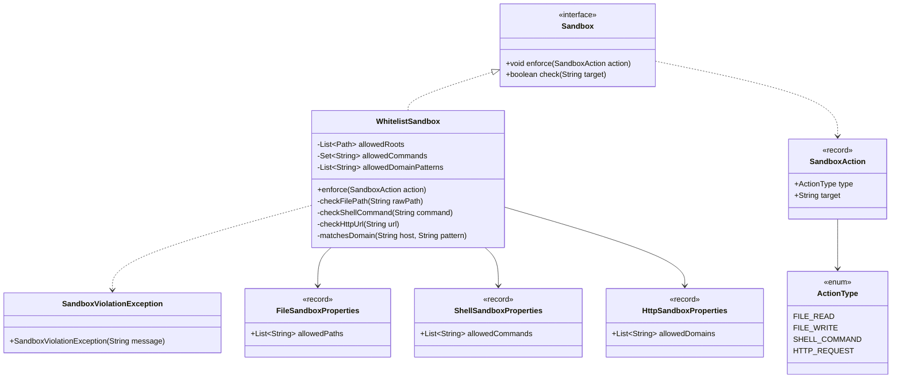

# Data Model: Lesson 24 - Sandbox Domain Model

## 1. 领域模型结构



## 2. 模型定义说明

### 2.1 动作类型 (`ActionType`)
```java
public enum ActionType {
  FILE_READ,
  FILE_WRITE,
  SHELL_COMMAND,
  HTTP_REQUEST
}
```

### 2.2 沙箱动作描述 (`SandboxAction`)
```java
public record SandboxAction(ActionType type, String target) {
  public SandboxAction {
    Objects.requireNonNull(type, "type must not be null");
    Objects.requireNonNull(target, "target must not be null");
  }
}
```

### 2.3 违规异常 (`SandboxViolationException`)
```java
public class SandboxViolationException extends RuntimeException {
  public SandboxViolationException(String message) {
    super(message);
  }
}
```

### 2.4 配置属性绑定 Record
```java
@ConfigurationProperties(prefix = "file")
public record FileSandboxProperties(List<String> allowedPaths) {
  public FileSandboxProperties {
    if (allowedPaths == null) {
      allowedPaths = List.of();
    }
  }
}

@ConfigurationProperties(prefix = "shell")
public record ShellSandboxProperties(List<String> allowedCommands) {
  public ShellSandboxProperties {
    if (allowedCommands == null) {
      allowedCommands = List.of();
    }
  }
}

@ConfigurationProperties(prefix = "http")
public record HttpSandboxProperties(List<String> allowedDomains) {
  public HttpSandboxProperties {
    if (allowedDomains == null) {
      allowedDomains = List.of();
    }
  }
}
```
