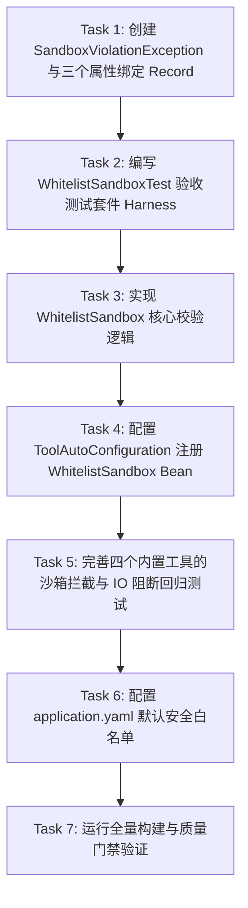

# Tasks: 第24节 Sandbox 实现与代码讲解

**Branch**: `024-lesson24-sandbox` | **Plan**: [plan.md](file:///e:/study/aiprogram/oryxos/specs/024-lesson24-sandbox/plan.md) | **Spec**: [spec.md](file:///e:/study/aiprogram/oryxos/specs/024-lesson24-sandbox/spec.md)

## 任务依赖关系图

---

## 阶段一：契约与配置定义 (Phase 1: Foundations & Properties)

- [x] **Task 1: 创建 SandboxViolationException 与三个属性绑定 Record**
  - **路径**: `oryxos-tool/src/main/java/com/oryxos/tool/sandbox/`
  - **内容**:
    - 创建 `SandboxViolationException` 继承 `RuntimeException`
    - 创建 `FileSandboxProperties` 绑定 `prefix = "file"`（`allowedPaths`）
    - 创建 `ShellSandboxProperties` 绑定 `prefix = "shell"`（`allowedCommands`）
    - 创建 `HttpSandboxProperties` 绑定 `prefix = "http"`（`allowedDomains`）
  - **产物**: `SandboxViolationException.java`, `FileSandboxProperties.java`, `ShellSandboxProperties.java`, `HttpSandboxProperties.java`
  - **依赖**: 无

---

## 阶段二：安全沙箱测试先行 (Phase 2: WhitelistSandbox TDD)

- [x] **Task 2: 编写 WhitelistSandboxTest 验收测试套件 (Harness 先行)**
  - **路径**: `oryxos-tool/src/test/java/com/oryxos/tool/sandbox/WhitelistSandboxTest.java`
  - **内容**:
    - 测试用例 1: `相对路径穿越必须被拦`（构造 `/workspace/../../outside/secret.txt` 断言抛出 `SandboxViolationException`）
    - 测试用例 2: `通配符域名_不能被形似域名绕过`（配置 `*.example.com`，断言 `api.example.com` 放行而 `evil-example.com` 必拦截）
    - 测试用例 3: `文件白名单内放行与白名单外拒绝`（正常子路径放行，白名单外拒绝）
    - 测试用例 4: `Shell命令白名单与首Token提取`（支持首部空白安全截取，合法命令放行，非法命令如 `rm` 拒绝）
    - 测试用例 5: `配置为空全闭原则`（空属性配置下拒绝所有文件、Shell 与 HTTP 操作）
  - **产物**: `WhitelistSandboxTest.java`
  - **依赖**: Task 1

---

## 阶段三：沙箱实现与自动装配 (Phase 3: Implementation & AutoConfiguration)

- [x] **Task 3: 实现 WhitelistSandbox 核心白名单校验类**
  - **路径**: `oryxos-tool/src/main/java/com/oryxos/tool/sandbox/WhitelistSandbox.java`
  - **内容**:
    - 实现 `Sandbox` 接口的 `enforce(SandboxAction action)` 与 `check(String target)`
    - 针对 `FILE_READ` / `FILE_WRITE`：调用私有 `checkFilePath`，使用 `Path.normalize().toAbsolutePath()` 防穿越
    - 针对 `SHELL_COMMAND`：调用私有 `checkShellCommand`，提取首个 token 精确比对
    - 针对 `HTTP_REQUEST`：调用私有 `checkHttpUrl`，校验精确域名或带点号边界的通配符域名（`*.domain.com`）
    - 空配置全闭：未配置或空列表时严格拒绝所有请求
  - **产物**: `WhitelistSandbox.java`
  - **依赖**: Task 2

- [x] **Task 4: 更新 ToolAutoConfiguration 注册 WhitelistSandbox**
  - **路径**: `oryxos-tool/src/main/java/com/oryxos/tool/config/ToolAutoConfiguration.java`
  - **内容**:
    - 启用 `@EnableConfigurationProperties({FileSandboxProperties.class, ShellSandboxProperties.class, HttpSandboxProperties.class})`
    - 注册 `WhitelistSandbox` 作为 `Sandbox` 的 Spring `@Bean`，移除临时的 `DefaultSandbox` 占位实现
  - **产物**: `ToolAutoConfiguration.java`
  - **依赖**: Task 3

---

## 阶段四：内置 Tool 接驳与物理 IO 阻断回归 (Phase 4: Tool Integration & Verification)

- [x] **Task 5: 完善内置工具回归测试断言物理 IO 绝对不发生**
  - **路径**:
    - `oryxos-tool/src/test/java/com/oryxos/tool/builtin/FileToolsTest.java`
    - `oryxos-tool/src/test/java/com/oryxos/tool/builtin/ShellToolsTest.java`
    - `oryxos-tool/src/test/java/com/oryxos/tool/builtin/HttpToolsTest.java`
    - `oryxos-tool/src/test/java/com/oryxos/tool/builtin/NotifyToolsTest.java`
  - **内容**:
    - 验证被沙箱拦截时抛出 `SandboxViolationException`
    - 使用 Mockito `verify(..., never())` 或真实物理状态检查，证明危险操作被拦截后底层真实物理 IO（文件读写、系统进程、HTTP 请求）绝对未发生
  - **产物**: 更新上述 4 个测试类
  - **依赖**: Task 4

---

## 阶段五：配置与全量质量门禁 (Phase 5: Configuration & Quality Gates)

- [x] **Task 6: 配置 application.yaml 默认安全白名单**
  - **路径**: `oryxos-boot/src/main/resources/application.yaml`
  - **内容**:
    - 配置 `file.allowed_paths`（如 `.oryxos` 等）
    - 配置 `shell.allowed_commands`（如 `ls`, `git` 等）
    - 配置 `http.allowed_domains`（如主流大模型与通知平台域名）
  - **产物**: `application.yaml`
  - **依赖**: Task 5

- [x] **Task 7: 质量门禁与跨节回归全绿验证**
  - **内容**:
    - 运行 `mvn test -pl oryxos-tool -am` 确认新增 harness 测试全部通过
    - 运行全量 `mvn clean verify` 确认 Spotless、Checkstyle、P3C-PMD、SpotBugs、OWASP 0 违规
    - 确认前序第 16~22 节交付物与测试回归 100% 通过
  - **依赖**: Task 6
