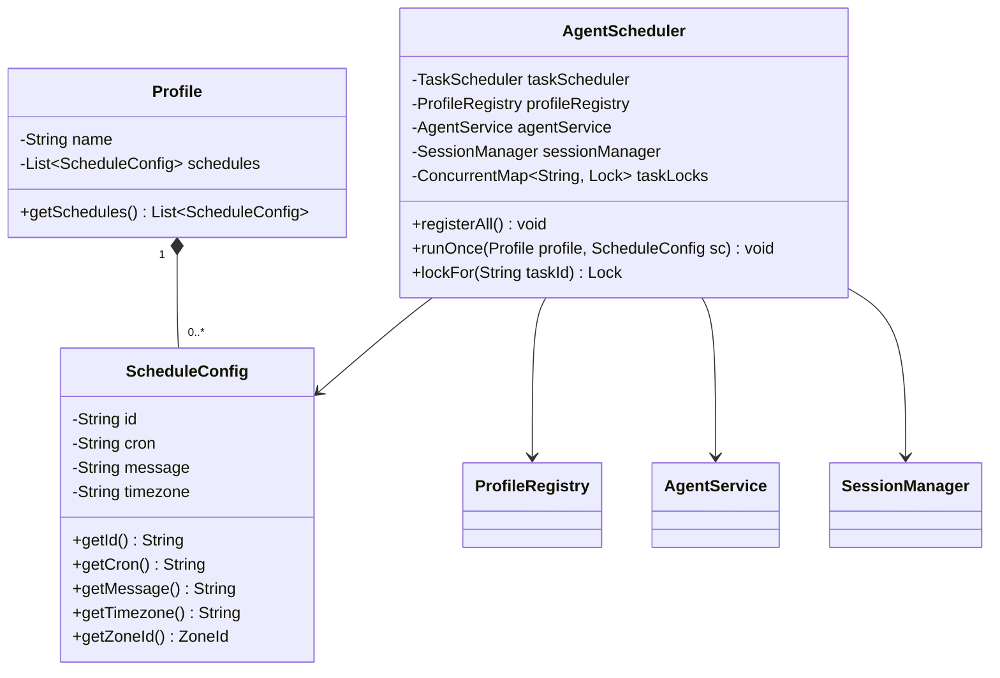

# Data Model: Lesson 25 - Scheduler Domain Model

## 1. 领域模型结构



## 2. 模型实体定义

### 2.1 调度配置 (`Profile.ScheduleConfig`)
```java
public static class ScheduleConfig implements Serializable {
  private static final long serialVersionUID = 1L;

  private String id;
  private String cron;
  private String message;
  private String timezone;

  public String getId() {
    if (id != null && !id.isBlank()) {
      return id;
    }
    // 缺省根据 cron 和 message 派生稳定标识
    return "task-" + Integer.toHexString((cron + ":" + message).hashCode());
  }

  public ZoneId getZoneId() {
    if (timezone != null && !timezone.isBlank()) {
      try {
        return ZoneId.of(timezone.trim());
      } catch (DateTimeException e) {
        // 非法时区安全回退
      }
    }
    return ZoneId.systemDefault();
  }
}
```

### 2.2 调度器实现 (`com.oryxos.core.scheduler.AgentScheduler`)
- 职责：维护任务锁映射，监听系统就绪完成动态注册，执行 `runOnce` 触发 ReAct 执行流。
