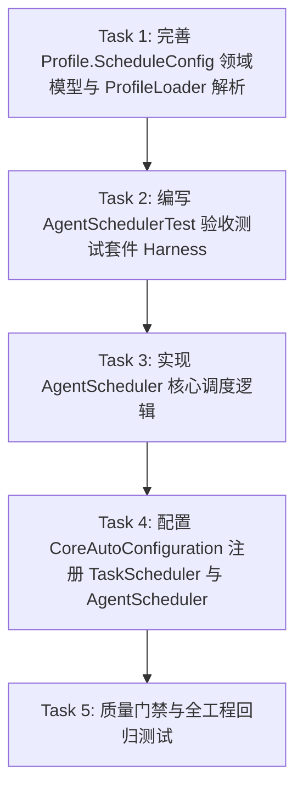

# Tasks: 第25节 定时任务模块 原理解析、实现与代码讲解

**Branch**: `025-lesson25-scheduler` | **Plan**: [plan.md](file:///e:/study/aiprogram/oryxos/specs/025-lesson25-scheduler/plan.md) | **Spec**: [spec.md](file:///e:/study/aiprogram/oryxos/specs/025-lesson25-scheduler/spec.md)

## 任务依赖关系图

---

## 阶段一：领域模型与配置增强 (Phase 1: Model & Configuration)

- [x] **Task 1: 完善 Profile.ScheduleConfig 领域模型与 ProfileLoader 解析**
  - **路径**:
    - `oryxos-core/src/main/java/com/oryxos/core/model/Profile.java`
    - `oryxos-core/src/main/java/com/oryxos/core/profile/ProfileLoader.java`
  - **内容**:
    - 在 `Profile.ScheduleConfig` 补充 `id` 字段及其 getter/setter，并在 `getId()` 实现缺省根据 `cron` 与 `message` 派生非空唯一 ID 逻辑
    - 在 `Profile.ScheduleConfig` 增加 `getZoneId()` 方法，安全解析 `timezone`（非法或为空时回退至 `ZoneId.systemDefault()`）
    - 确保 `ProfileLoader.populateSchedules` 解析 YAML 映射中的 `id` 字段
  - **产物**: 更新 `Profile.java`, `ProfileLoader.java`
  - **依赖**: 无

---

## 阶段二：调度验收测试先行 (Phase 2: Harness First)

- [x] **Task 2: 编写 AgentSchedulerTest 验收测试套件 (Harness 先行)**
  - **路径**: `oryxos-core/src/test/java/com/oryxos/core/scheduler/AgentSchedulerTest.java`
  - **内容**:
    - 测试用例 1: `注册时CronTrigger携带配置cron和时区`（使用 Mockito `ArgumentCaptor` 验证 `taskScheduler.schedule` 参数）
    - 测试用例 2: `上一次还没跑完_本次触发直接跳过`（加锁状态下直接调用 `runOnce`，断言 `agentService.process` 未被执行）
    - 测试用例 3: `任务抛异常_不外抛且锁必须被释放`（`agentService.process` 抛出异常后不外抛，二次触发正常执行证明锁成功释放）
    - 测试用例 4: `会话三元组固定_复用同一Session`（验证传入 `agentService.process` 的 Session，channel 和 user 均为 `"scheduler"`）
  - **产物**: `AgentSchedulerTest.java`
  - **依赖**: Task 1

---

## 阶段三：核心调度器实现 (Phase 3: Implementation)

- [x] **Task 3: 实现 AgentScheduler 核心调度类**
  - **路径**: `oryxos-core/src/main/java/com/oryxos/core/scheduler/AgentScheduler.java`
  - **内容**:
    - 聚合 `TaskScheduler`, `ProfileRegistry`, `AgentService`, `SessionManager`
    - 维护 `ConcurrentMap<String, Lock> taskLocks`
    - 提供 `lockFor(String taskId)` 方法供测试与状态核查
    - 实现 `registerAll()`：遍历所有 Profile 的 schedules，通过 `new CronTrigger(sc.getCron(), sc.getZoneId())` 注册
    - 实现 `runOnce(Profile profile, ScheduleConfig sc)`：`tryLock()` 获取锁，组装会话 `("scheduler", "scheduler", profile.getName())`，调用 `agentService.process`，并在 `finally` 块中确保释放锁
  - **产物**: `AgentScheduler.java`
  - **依赖**: Task 2

---

## 阶段四：Spring Boot 自动装配 (Phase 4: AutoConfiguration)

- [x] **Task 4: 配置 CoreAutoConfiguration 注册 TaskScheduler 与 AgentScheduler**
  - **路径**: `oryxos-core/src/main/java/com/oryxos/core/config/CoreAutoConfiguration.java`
  - **内容**:
    - 声明 `@ConditionalOnMissingBean` 的 `ThreadPoolTaskScheduler` Bean，设置线程池与名称前缀
    - 声明 `@ConditionalOnMissingBean` 的 `AgentScheduler` Bean
    - 在 `@PostConstruct` 或应用就绪时触发动态注册
  - **产物**: 更新 `CoreAutoConfiguration.java`
  - **依赖**: Task 3

---

## 阶段五：门禁验证与跨节回归 (Phase 5: Quality Gates & Regression)

- [x] **Task 5: 质量门禁与跨节回归全绿验证**
  - **内容**:
    - 运行 `mvn test -pl oryxos-core -am` 确认新增 harness 测试全部通过
    - 运行全量 `mvn clean verify` 确认 Spotless、Checkstyle、P3C-PMD、SpotBugs、OWASP 0 违规
    - 确认前序第 16~24 节交付物与测试回归 100% 通过
  - **依赖**: Task 4
